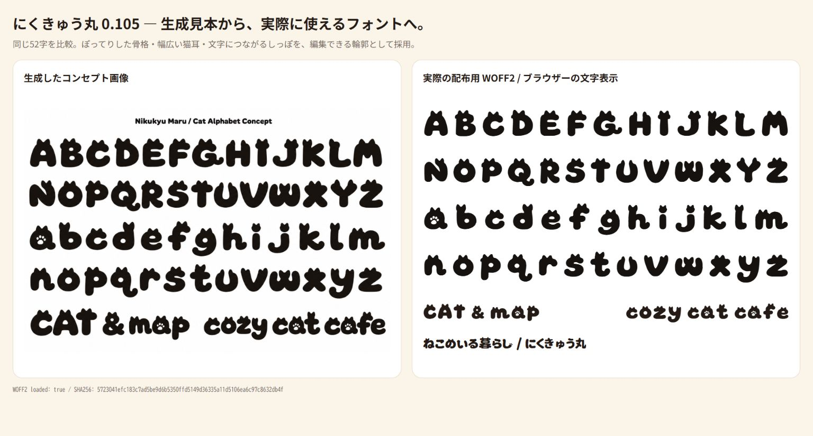

  <h1>🐾 Nikukyu Maru</h1>
  
<strong>A plump, cat-themed display font for Japanese and Latin headlines.</strong>

  
Rounded strokes, broad cat ears, paw details, and character-specific tails in a font you can actually use.

  

    
    
  

  
<a href="README.ja.md">日本語 README</a> · <a href="https://sunwood-ai-labs.github.io/nikukyu-maru-font/">Japanese showcase</a> · <a href="https://sunwood-ai-labs.github.io/nikukyu-maru-font/en/">English showcase</a>

  
  
<em>0.105 Latin concept reference and the released WOFF2 side by side.</em>

## 🐾 What it is

Nikukyu Maru is a heavy, friendly display face for posters, titles, thumbnails, and other horizontal text. Release 0.105 brings the generated cat-letter direction into the usable font: A–Z, a–z, and &amp;, plus their 53 fullwidth counterparts, have rounded image-derived outlines with broad ears and tails that follow each letter's stroke.

The 53 Latin masters were traced from [04-latin-cat-concept.png](references/04-latin-cat-concept.png), a concept sheet generated with the built-in image generation tool. Its prompt is preserved in [04-latin-cat-concept-prompt.md](references/04-latin-cat-concept-prompt.md). The PNG is a visual reference; the released font uses cleaned, editable outlines with explicit widths and baselines.

Japanese kana and kanji keep the soft, rounded direction of the project. Their upstream sources and the way they are combined are documented in [SUPPLEMENTAL-SOURCES.md](sources/SUPPLEMENTAL-SOURCES.md).

## 📦 Download

The v0.105 release contains the desktop font, web font, and a source bundle.

- [Download TTF](https://github.com/Sunwood-ai-labs/nikukyu-maru-font/releases/download/v0.105/NikukyuMaru-Regular.ttf) for desktop applications.
- [Download WOFF2](https://github.com/Sunwood-ai-labs/nikukyu-maru-font/releases/download/v0.105/NikukyuMaru-Regular.woff2) for the web.
- [Download the v0.105 source ZIP](https://github.com/Sunwood-ai-labs/nikukyu-maru-font/releases/download/v0.105/NikukyuMaru-0.105.zip) for the editable UFO, references, scripts, and evidence.
- [Open the release page](https://github.com/Sunwood-ai-labs/nikukyu-maru-font/releases/tag/v0.105) for checksums and release notes.

The same files are kept in the repository as [TTF](outputs/NikukyuMaru-Regular.ttf) and [WOFF2](outputs/NikukyuMaru-Regular.woff2).

### Web use

~~~css
@font-face {
  font-family: "Nikukyu Maru";
  src: url("NikukyuMaru-Regular.woff2") format("woff2");
  font-weight: 800;
  font-style: normal;
  font-display: swap;
}

.cat-headline {
  font-family: "Nikukyu Maru", sans-serif;
  font-weight: 800;
  line-height: 1.55;
}
~~~

Download the WOFF2 asset, place it on your own site, and reference that same-origin file from CSS. This avoids relying on GitHub Release CORS and browser distribution behavior. For a desktop app, install the TTF through the operating system's normal font installer.

## 🧪 Try it

- [Open the Japanese showcase](https://sunwood-ai-labs.github.io/nikukyu-maru-font/) to see the font in its primary Japanese presentation.
- [Open the English showcase](https://sunwood-ai-labs.github.io/nikukyu-maru-font/en/) for the English-language tour.
- [Compare every 0.105 Latin glyph](outputs/latin-concept-review/), including the fullwidth set and 16/24/32/48px samples.
- [View the 0.105 concept overview](outputs/latin-concept-review/comparison.png) or the [generated reference](references/04-latin-cat-concept.png).

## 🗺️ Coverage

The current build reports **7,516 Unicode characters and 7,547 glyphs** in [verification.json](outputs/verification.json). Unicode characters and glyphs differ because the font also contains alternates, combining marks, and internal glyphs.

- Hiragana, katakana, fullwidth forms, common punctuation, symbols, Greek, Cyrillic, and Latin are included.
- The Japanese set includes all 6,355 JIS X 0208 kanji used by this project, practical CP932 additions, and 63 halfwidth kana characters in U+FF61–U+FF9F.
- U+3099 and U+309A are zero-width combining marks. OpenType ccmp handles the documented precomposed and halfwidth voiced and semi-voiced combinations.
- ss01 provides paw alternates for こ and る. U+E000 is the project paw, U+E001 is the cat face, and U+1F43E is the paw-print character.
- Release 0.105 changes 106 Unicode code points: the 53 image-derived ASCII glyphs and their 53 fullwidth counterparts. Other coverage is retained and checked through structural regression.

This is a horizontal display font. Vertical layout metrics, vertical alternates, kerning, and hinting are not implemented. At small sizes, ears, paw pads, and small counters become less distinct; use a heavier headline size when those details matter.

## 🛠️ Edit and rebuild

The source of truth is the editable UFO and the design data in sources/. A local virtual environment keeps the pinned requirements isolated. [uv](https://docs.astral.sh/uv/) is the recommended runner:

~~~powershell
uv venv
.\.venv\Scripts\Activate.ps1
uv pip install -r requirements.txt
uv run --active python -X utf8 build.py
~~~

To retrace the 0.105 Latin concept, install the trace requirements and run the image-to-outline steps before the normal build:

~~~powershell
uv pip install -r requirements-trace.txt
uv run --active python -X utf8 trace_latin_concept.py
uv run --active python -X utf8 latin_cats.py
uv run --active python -X utf8 build.py
uv run --active python -X utf8 concept_latin_review.py
uv run --active python -X utf8 concept_latin_overview.py
~~~

Validation dependencies extend the same environment:

~~~powershell
uv pip install -r requirements-validation.txt
uv run --active python -X utf8 verify_latin_concept.py
uv run --active python -X utf8 japanese_validation.py
~~~

build.py --regenerate recreates the UFO from the design data and can overwrite manual UFO edits. Keep a working copy or branch for experiments. The concept trace records its source box, scale, and baseline in [latin-concept-outlines.json](sources/latin-concept-outlines.json); do not silently replace that provenance with a different source.

The documentation site uses the following local commands after installing its Node dependencies:

~~~powershell
npm ci
npm run docs:dev
npm run docs:build
npm run docs:preview
npm run site:check
~~~

## ✅ Quality checks

[Showcase verification and published screenshots](verification/site-showcase.md) record browser interactions, responsive checks, deployment evidence, and remaining development-dependency audit findings.

The current 0.105 evidence is separated by purpose:

- [Machine verification](outputs/verification.json) records coverage, TTF/WOFF2 cmap parity, non-space rasterization, bounds checks, and SHA-256 values.
- [Reference fidelity](outputs/latin-concept-review/reference-fidelity.json) compares the 53 Latin outlines with their individual image boxes using silhouette overlap, aspect ratio, and hole counts. It is a structural signal, not a substitute for visual review.
- [Regression and reproducibility](outputs/latin-concept-review/regression.json) records the 106 intended changes, unchanged glyphs, cmap/GSUB checks, isolated compilation, and outline reapplication.
- [Visual verification](outputs/latin-concept-review/visual-verification.json) maps the final screenshots to their characters and font hash. [REVIEW.md](outputs/latin-concept-review/REVIEW.md) explains the decisions.
- [Character inventory](outputs/CHARACTERS.md) lists every supported Unicode character and its name.

The 0.103 158-page Japanese audit and practical cases, and the 0.104 Latin pages, remain available as historical evidence in [FINAL-REVIEW.md](outputs/FINAL-REVIEW.md), [practical-review](outputs/practical-review/), and [latin-review](outputs/latin-review/). They describe their own release and are not substitutes for the current 0.105 checks.

## 📚 Credits and license

| Use | Source | Notice |
| --- | --- | --- |
| General kanji base and supplemental symbols | [Zen Maru Gothic Black](https://github.com/googlefonts/zen-marugothic) | [vendor/ZenMaruGothic-OFL.txt](vendor/ZenMaruGothic-OFL.txt) |
| Kana, Latin, and other non-kanji base outlines | [Mochiy Pop One](https://github.com/google/fonts/tree/main/ofl/mochiypopone) | [vendor/OFL.txt](vendor/OFL.txt) |
| 0.105 Latin concept reference | [04-latin-cat-concept.png](references/04-latin-cat-concept.png), generated with the built-in image generation tool | [prompt and trace record](references/04-latin-cat-concept-prompt.md) |

The upstream copyright notices and SIL Open Font License 1.1 texts remain in vendor/. The top-level [LICENSE](LICENSE) is the same project notice and OFL text as [OFL.txt](OFL.txt). Under the OFL, the font may be used, modified, embedded, and redistributed, including with software; the font itself must not be sold alone, and modified font software remains under the OFL. Preserve the notices and license when redistributing it.

## 🗂️ Repository layout

- outputs/NikukyuMaru-Regular.ttf — desktop font.
- outputs/NikukyuMaru-Regular.woff2 — web font.
- sources/NikukyuMaru-Regular.ufo/ — editable UFO source.
- sources/design.json — build settings and release version.
- references/ — concept images and their prompts.
- build.py, trace_latin_concept.py, and latin_cats.py — build and 0.105 Latin tracing tools.
- outputs/latin-concept-review/ — current image comparisons, reports, and screenshots.
- docs/ — VitePress showcase source, published at the Japanese and English showcase links above.

## 🤝 Contributing and support

Read [CONTRIBUTING.md](CONTRIBUTING.md) before changing outlines, build data, or validation code. Use [SUPPORT.md](SUPPORT.md) for usage questions and reproducible issue details. The repository's issue forms are designed to keep font version, code points, rendering environment, and evidence together.
