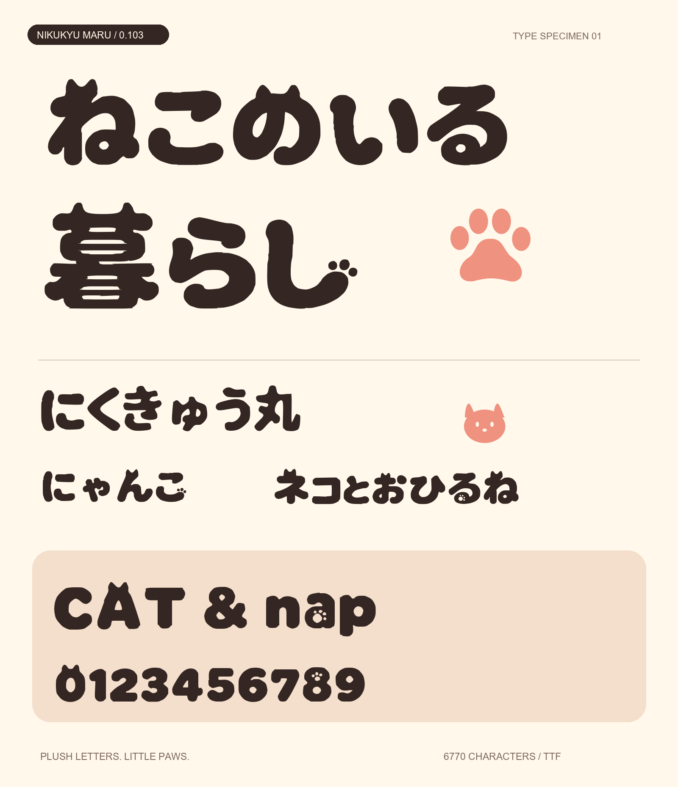

# にくきゅう丸 — 0.103 開発中

> 日本語対応を拡張中です。現在の開発版は6,770文字で、JIS第1・第2水準の漢字6,355字を含みます。記号補完・結合濁点・追加文字のスクショ監査は進行中です。配布済み安定版は[0.102](https://github.com/Sunwood-ai-labs/nikukyu-maru-font/releases/tag/v0.102)です。



[TTFをダウンロード](outputs/NikukyuMaru-Regular.ttf) · [WOFF2](outputs/NikukyuMaru-Regular.woff2) · [全収録文字](outputs/CHARACTERS.md) · [全文字のスクショ監査](outputs/audit/REVIEW.md)

0.102では全角77文字・小書きかな24文字・濁音57文字を基本字形から派生させ、残る文字の丸め処理と英字の高さを改善しました。全文字を9枚の実Chromeスクショで点検しています。38文字の参照輪郭化は0.101で導入したものです。

猫耳と肉球を添えた、太く柔らかい横組み見出し用フォントです。主要38文字と装飾異体字2個には採用画像由来の輪郭を使い、その他はMochiy Pop Oneの輪郭を文字ごとに丸めて調整しています。

## 使う

`outputs/NikukyuMaru-Regular.ttf` をダブルクリックし、Windows のフォントプレビューから「インストール」を選びます。アプリのフォント一覧では「にくきゅう丸」または「Nikukyu Maru」を選択してください。OS への常設インストールは今回行っていません。

Web 用は `outputs/NikukyuMaru-Regular.woff2` です。

```css
@font-face {
  font-family: "Nikukyu Maru";
  src: url("NikukyuMaru-Regular.woff2") format("woff2");
  font-weight: 800;
  font-style: normal;
}
.headline { font-family: "Nikukyu Maru", sans-serif; font-weight: 800; line-height: 1.55; }
```

## 収録範囲

開発版は6,770 Unicode文字（空白・私用領域を含む）、6,773グリフ。ひらがな・カタカナ・ASCII・全角英数字・基本記号と、JIS第1・第2水準の漢字6,355字を収録しています。

完全な一覧は `outputs/CHARACTERS.md` と `outputs/characters.txt`。肉球は U+E000、猫顔は U+E001、足跡は U+1F43E です。絵文字を優先するアプリでは U+1F43E が別書体になる場合があるため、肉球単体には U+E000 を使います。

現在補完中: Windows拡張漢字・記号、半角カナ、結合濁点 U+3099・U+309A、★☆゛゜＃＊－￥など。濁音・半濁音は「が」「ぱ」などの合成済み文字（NFC）を使ってください。縦組み専用処理、カーニング、ヒンティングは未実装です。小サイズでは装飾や細かな空間が見えにくいため、大きな見出し向けです。

## 編集と再ビルド

0.102の「こ・る」はOpenTypeのスタイルセット1（`ss01`）で肉球付きに切り替えます。Webでは `font-feature-settings: "ss01" 1` を指定してください。「a・8」は標準で肉球の抜き模様を含みます。

採用画像由来の輪郭は `sources/reference-outlines.json` に保存しています。`--regenerate` は元書体の処理後、この輪郭を優先してUFOに適用します。画像からの抽出をやり直す場合のみ `requirements-trace.txt` を導入し、`trace_reference.py` を実行します。通常ビルドではOpenCVは不要です。

```powershell
.\.venv\Scripts\python.exe -m pip install -r requirements-trace.txt
.\.venv\Scripts\python.exe -X utf8 trace_reference.py
.\.venv\Scripts\python.exe -X utf8 build.py --regenerate
```

比較画面の再生成は `compare.py`。プロジェクト直下をHTTPサーバーで配信して `outputs/comparison/page-1.html` を開きます。`revised-1.png` ～ `revised-3.png` が0.102の実Chromeスクショ、`compare-*.png` は修正前の記録です。見本画像は通常形とss01を使い分けています。WindowsのPillowにはOpenType機能の描画支援がないため、PNG見本の該当2行は同じTTF内の異体字にcmapを切り替えた一時ファイルで描画しています。実際のss01動作はChromeで確認しています。

検証環境: Windows / Python 3.12。依存バージョンは `requirements.txt` に固定しています。

```powershell
cd C:\Prj\nikukyu-maru-font
python -m venv .venv
.\.venv\Scripts\python.exe -m pip install -r requirements.txt
.\.venv\Scripts\python.exe -X utf8 build.py
```

通常ビルドは `sources/NikukyuMaru-Regular.ufo` の編集内容から TTF・WOFF2・SVG・見本・検証記録を生成します。UFO 対応フォントエディターで輪郭を編集できます。1文字ごとの編集可能な SVG は `outputs/glyph-svg/` にあります（SVG変更は自動でUFOには戻りません）。

猫耳の位置、太さ、追加文字などは `sources/design.json` で指定します。次のコマンドは元フォントからUFOを再生成し、**UFOへの手編集を上書き**します。手編集後は先にUFOを別名保存してください。

```powershell
.\.venv\Scripts\python.exe -X utf8 build.py --regenerate
```

元フォントは `vendor/` に同梱済みで、依存導入後のビルドはオフラインで実行できます。見本生成は Windows の Arial を見出しラベルに使います。フォント本文は生成TTFのみで描画し、代替フォントを使いません。

## 検証と成果物

`python -X utf8 audit_pages.py` で現在の全収録文字＋2異体字のブラウザー確認ページを生成します。`python -X utf8 package.py` で環境ファイルを含まないZIPを作成します。`harmonize.py` と `artifact_io.py` もビルドに必要です。`outputs/audit/manifest.json` がスクショの対象一覧です。

- `outputs/specimen.png`: 実TTFで描画した使用見本。
- `outputs/charset-*.png`: 全収録文字の一覧画像。
- `outputs/size-proof.png`: 16・24・32・48・72pxの文字組み。
- `outputs/verification.json`: 全非空白文字の64px描画、字幅・上下範囲、TTF/WOFF2の対応文字一致、SHA-256。

ビルドは検証エラーがあれば失敗終了します。全アプリでの表示互換性やOSへの常設インストールは未検証です。

## 出典とライセンス

元書体: [Mochiy Pop One / Google Fonts](https://github.com/google/fonts/tree/main/ofl/mochiypopone)。著作者: The Mochiypop Project Authors。元TTFのSHA-256: `9e009430e1316c271a5f34759c6b65fc343c4e806f193042528887e7235a92c6`。

同梱の `vendor/OFL.txt` と `outputs/OFL.txt` がライセンス原文です。本派生フォントも SIL Open Font License 1.1 を適用し、元の著作権表示を保持します。フォント単体販売は禁止され、再配布時は著作権表示とライセンスの同梱が必要です。新しい書体名を設定済みです。ユーザーの追加指示によりGitHubで公開しています。販売は行っていません。


