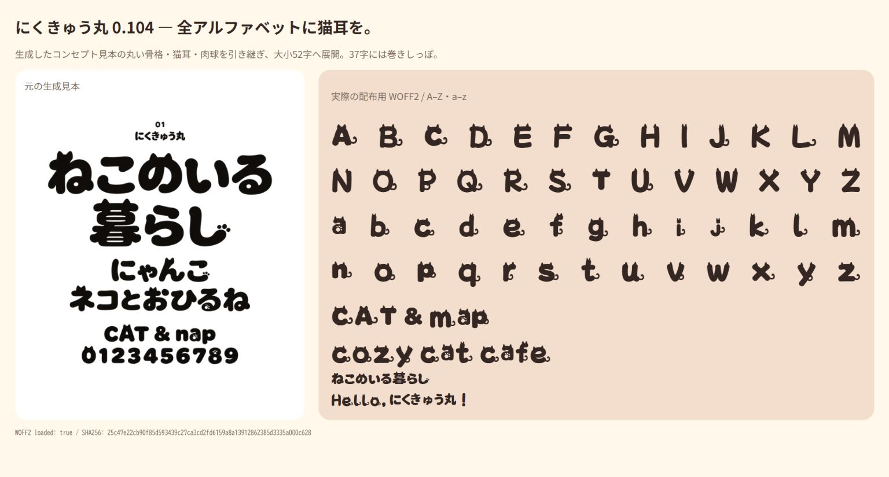

# にくきゅう丸 — 0.104

**A–Z / a–z の52字すべてに猫耳。37字には巻きしっぽ。** 全角英字52字にも反映した、太く柔らかい見出し用フォントです。



[TTF](outputs/NikukyuMaru-Regular.ttf) · [WOFF2](outputs/NikukyuMaru-Regular.woff2) · [リリース](https://github.com/Sunwood-ai-labs/nikukyu-maru-font/releases/tag/v0.104) · [全収録文字](outputs/CHARACTERS.md) · [英字104字のスクリーンショット](outputs/latin-review/) · [英字の設計と編集](sources/LATIN-DESIGN.md)

0.104は **7,516 Unicode文字 / 7,547グリフ**。半角・全角英字104字を8枚のChromeスクリーンショットで確認し、元の生成見本とも比較しました。[独立レビュー](outputs/latin-review/independent-review.md)でも耳の位置、しっぽの接続、欠け・セル外切れを確認しています。i/jの点は小さな猫頭、aは既存の肉球入りデザインです。

[回帰検証](outputs/latin-review/regression.json)では輪郭変更が英字104字と完全一致し、メトリクス変更はそのうち72字、残る7,443グリフは不変です。Unicode集合・glyphOrder・GSUBも0.103と一致し、隔離したUFOからの通常コンパイルはTTF・WOFF2ともバイト一致しました。[機械検証](outputs/verification.json)は現行0.104、[スクショ記録](outputs/latin-review/visual-verification.json)は確認画像と現行フォントのSHAを記録しています。

0.103の[158ページ全字監査](outputs/FINAL-REVIEW.md)、[実用31ケース](outputs/practical-review/)、[全再生成](outputs/reproducibility-verification.json)、[ZIP再ビルド](outputs/package-verification.json)は旧版の証跡です。0.104で実施した検証範囲は上記の英字レビュー・全字形の差分比較・通常コンパイルの再現確認です。

猫耳と肉球を添えた、太く柔らかい横組み見出し用フォントです。一般漢字の基準輪郭にはZen Maru Gothic Blackを採用し、かな・英字はMochiy Pop Oneを基礎とします。Zenにない漢字はMochiy Pop Oneの輪郭で補完し、Mochiyにない記号はZen Maru Gothic Blackの輪郭と既存字形を組み合わせて構成します。

画像生成見本から選んだ`名・今・日・月・年・店・休・住`の8字は、`sources/kanji-concept-outlines.json`のベクター輪郭として0.103に採用済みです。元の参照輪郭はJSON上40キーで、Unicode文字38キーとss01用の`.alt` 2キー（`こ.alt`・`る.alt`）に分かれます。小書きの`ゃ`・`ゅ`は読みやすさを優先してharmonizeで通常かなから派生するため、0.103で最終的に直接適用される元参照はUnicode36字形と`.alt` 2字形です。8字を加えた0.103時点の画像由来の直接適用輪郭はUnicode44字形と`.alt` 2字形でした。0.104では英字を猫耳・しっぽ付きへ追加加工しています。詳細な採用範囲は[コンセプトレビュー](sources/KANJI-CONCEPT-REVIEW.md)に記録しています。

**ダウンロード:** [TTF](https://github.com/Sunwood-ai-labs/nikukyu-maru-font/releases/download/v0.104/NikukyuMaru-Regular.ttf) · [WOFF2](https://github.com/Sunwood-ai-labs/nikukyu-maru-font/releases/download/v0.104/NikukyuMaru-Regular.woff2) · [ソース・検証画像を含むZIP](https://github.com/Sunwood-ai-labs/nikukyu-maru-font/releases/download/v0.104/NikukyuMaru-0.104.zip)

## 使う

Web用は`outputs/NikukyuMaru-Regular.woff2`です。

```css
@font-face {
  font-family: "Nikukyu Maru";
  src: url("NikukyuMaru-Regular.woff2") format("woff2");
  font-weight: 800;
  font-style: normal;
}
.headline {
  font-family: "Nikukyu Maru", sans-serif;
  font-weight: 800;
  line-height: 1.55;
}
```

WindowsではTTFをダブルクリックしてプレビューを開き、「インストール」から使用できます。本リポジトリの確認では`verify_windows_font.py`からWindows GDIのprivate fontとして読み込み、確認後に解除しました。OSへの常設インストールは行っていません。

## 0.103で確定した収録範囲と組版

0.104の生成TTFはcmap 7,516 Unicode文字、glyphOrder 7,547グリフです。ひらがな・カタカナ・ASCII・全角英数字・基本記号、JIS X 0208の漢字6,355字、CP932の実用拡張、追加記号を収録しています。半角カナはU+FF61〜U+FF9Fの63字です。

- U+3099（結合濁点）とU+309A（結合半濁点）は零幅のマークです。
- NFCの「が」「ぱ」などと、NFDの「か」+U+3099、「は」+U+309Aなどは、OpenTypeの`ccmp`で既存の合成済み字形へ置換します。canonicalな組み合わせは58組です。
- 半角の「ｶﾞ」「ﾊﾟ」など28組も`ccmp`で処理します。通常の半角字形は500単位、合成後の濁音・半濁音は2セル分の1,000単位を保ちます。
- 「こ」「る」は`ss01`で肉球付きの異体字に切り替えられます。Webでは`font-feature-settings: "ss01" 1`を指定してください。
- U+E000は肉球、U+E001は猫顔、U+1F43Eは足跡です。絵文字を優先するアプリではU+1F43Eが別書体になる場合があるため、肉球単体にはU+E000を使います。

用途は太い横組み見出しです。縦組み専用の回転・縦用メトリクス、カーニング、ヒンティングは実装していません。小サイズでは肉球や半濁点などの細部が見えにくい場合があります。

## 編集と再ビルド

通常ビルドは`sources/NikukyuMaru-Regular.ufo`からTTF・WOFF2・SVG・見本・検証記録を生成します。`--regenerate`は元フォントからUFOを再生成し、UFOへの手編集を上書きします。画像からの参照輪郭抽出をやり直す場合だけ`requirements-trace.txt`を導入します。

```powershell
cd C:\Prj\nikukyu-maru-font
python -m venv .venv
.\.venv\Scripts\python.exe -m pip install -r requirements.txt
.\.venv\Scripts\python.exe -X utf8 build.py --regenerate
```

0.104の英字猫化は、sources/latin-base-outlines.jsonとlatin_cats.pyをbuild.pyから読み込むため、上記の再生成コマンドで再現できます。

参照輪郭の再抽出:

```powershell
.\.venv\Scripts\python.exe -m pip install -r requirements-trace.txt
.\.venv\Scripts\python.exe -X utf8 trace_reference.py
.\.venv\Scripts\python.exe -X utf8 build.py --regenerate
```

画像生成由来の8字輪郭は`trace_kanji_concept.py`で再現できます。現在の採用輪郭を変更する場合は、`sources/kanji-concept-outlines.json`、参照画像、生成条件を同時に確認してください。比較証跡は[kanji-base-comparison.md](outputs/concept-review/kanji-base-comparison.md)と[kanji-base-comparison.png](outputs/concept-review/kanji-base-comparison.png)です。

## 0.103の検証と成果物

以下の検証記録は0.103確定版の成果物を対象にしたものです。0.104の英字レビューはlatin-reviewの証跡が揃ってから判定します。これらは0.103の歴史証跡であり、0.104の全収録文字再監査結果ではありません。

通常依存は`requirements.txt`です。検証用の`requirements-validation.txt`は`requirements-trace.txt`を参照してOpenCV・NumPy等を導入し、`uharfbuzz`を追加します。通常ビルドには`uharfbuzz`を追加していません。

```powershell
.\.venv\Scripts\python.exe -m pip install -r requirements-validation.txt
.\.venv\Scripts\python.exe -X utf8 verify_kana_shaping.py --font outputs\NikukyuMaru-Regular.ttf --report outputs\kana-shaping-verification.json
.\.venv\Scripts\python.exe -X utf8 verify_kanji_concept.py --font outputs\NikukyuMaru-Regular.ttf --report outputs\concept-review\kanji8-final-verification.json --image outputs\concept-review\kanji8-final-render.png --small-image outputs\concept-review\kanji8-final-sizes.png
.\.venv\Scripts\python.exe -X utf8 japanese_validation.py
.\.venv\Scripts\python.exe -X utf8 proof.py
.\.venv\Scripts\python.exe -X utf8 verify_windows_font.py
```

`japanese_validation.py`は実用文章、JIS/CP932範囲、結合濁点、半角カナ、輪郭範囲、TTF/WOFF2の対応文字一致を検査します。`verify_kana_shaping.py`は独立fixtureと本番TTFでcanonical58組・半角28組をHarfBuzz検証します。`verify_kanji_concept.py`は採用8字の構造、輪郭範囲、180pxおよび16・24・32・48pxの実描画をかなと並べて検査します。検証レポートと画像は、指定した場合を除き`work/`または`outputs/`に保存されます。

`audit_pages.py`で全収録文字の監査用HTMLとmanifestを生成します。0.103では158ページの画像を用意し、全ページの目視監査を完了しました。具体的な未描画、線の欠け、セル外への切れは確認されていません。全体記録は[最終表示レビュー](outputs/FINAL-REVIEW.md)、分担ページ41〜80の詳細は[review-41-80.md](outputs/audit/review-41-80.md)です。実用8カテゴリ31ケースのPNGは[outputs/practical-review/](outputs/practical-review/)にあります。

```powershell
.\.venv\Scripts\python.exe -X utf8 audit_pages.py
.\.venv\Scripts\python.exe -X utf8 package.py
```

- `outputs/specimen.png`: 実TTFで描画した使用見本。
- `outputs/charset-*.png`: 全収録文字の一覧画像。
- `outputs/size-proof.png`: 16・24・32・48・72pxの文字組み。
- `outputs/verification.json`: Unicode/glyph数、非空白文字の64px描画、字幅・上下範囲、TTF/WOFF2の対応文字一致、SHA-256。
- `outputs/japanese-validation.json`: 日本語コーパスと収録範囲の機械可読レポート。
- `outputs/kana-shaping-verification.json`: 本番TTFのcanonical/半角カナ組版結果。
- `outputs/concept-review/kanji8-final-verification.json`: 採用8字の構造・小サイズ検証結果。
- `outputs/windows-font-verification.json`: Windows private fontの一時読み込み結果。
- `outputs/audit/manifest.json`、`outputs/audit/font-hash.json`: 158ページの対象と対象フォントの記録。`outputs/visual-verification.json`に各スクリーンショットのハッシュを保存。`outputs/FINAL-REVIEW.md`に全体の確認結果を保存。

数値検証や一時読み込みの成功は、公開前の全文字目視監査や全アプリでの互換性を意味しません。

旧版との構造比較を行う場合だけ、手元に用意した旧TTFを--baseline-fontで指定します。通常の検証と配布物はwork/の旧版ファイルに依存しません。

## 出典とライセンス

| 用途 | 出典 | ライセンス表示 |
|---|---|---|
| 一般漢字の基準輪郭 | [Zen Maru Gothic Black](https://github.com/googlefonts/zen-marugothic) | `vendor/ZenMaruGothic-OFL.txt` |
| かな・英字、Zenにない漢字の補完 | [Mochiy Pop One / Google Fonts](https://github.com/google/fonts/tree/main/ofl/mochiypopone) | `vendor/OFL.txt` |
| Mochiyにない記号の構成 | Zen Maru Gothic Blackの輪郭 + 既存字形 | `vendor/ZenMaruGothic-OFL.txt` / `vendor/OFL.txt` |

Mochiyの著作者はThe Mochiypop Project Authors、Zenの著作者はThe Zen Maru Gothic Project Authorsです。Mochiyの元TTFのSHA-256は`9e009430e1316c271a5f34759c6b65fc343c4e806f193042528887e7235a92c6`です。Zen Maru Gothic Blackは`vendor/ZenMaruGothic-Black.ttf`として同梱し、取得元と固定コミットは`supplemental.py`に記録しています。

同梱の`OFL.txt`、`outputs/OFL.txt`、`vendor/`内のライセンスファイルにSIL Open Font License 1.1の表示を保持しています。本派生フォントもSIL Open Font License 1.1で配布します。再配布時は著作権表示とライセンスを同梱してください。

## 0.103の配布物と確認範囲

0.103の配布先は[0.103リリース](https://github.com/Sunwood-ai-labs/nikukyu-maru-font/releases/tag/v0.103)です。ZIPには編集用UFO、ビルドスクリプト、出典とライセンス、確認画像を含みます。[全再生成の一致](outputs/reproducibility-verification.json)と[ZIPからの再ビルド一致](outputs/package-verification.json)も0.103の歴史証跡として記録しています。OSへの常設インストールは行っていません。
