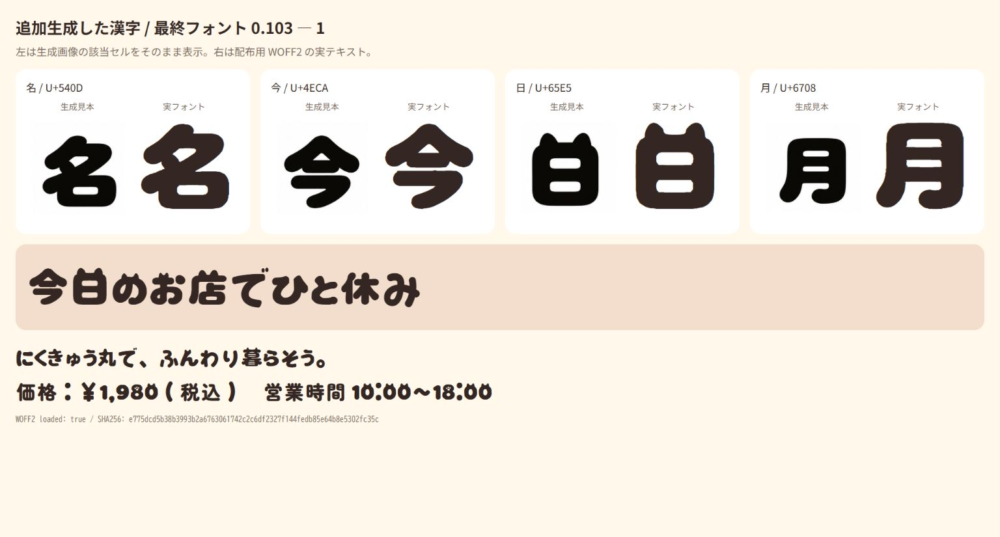
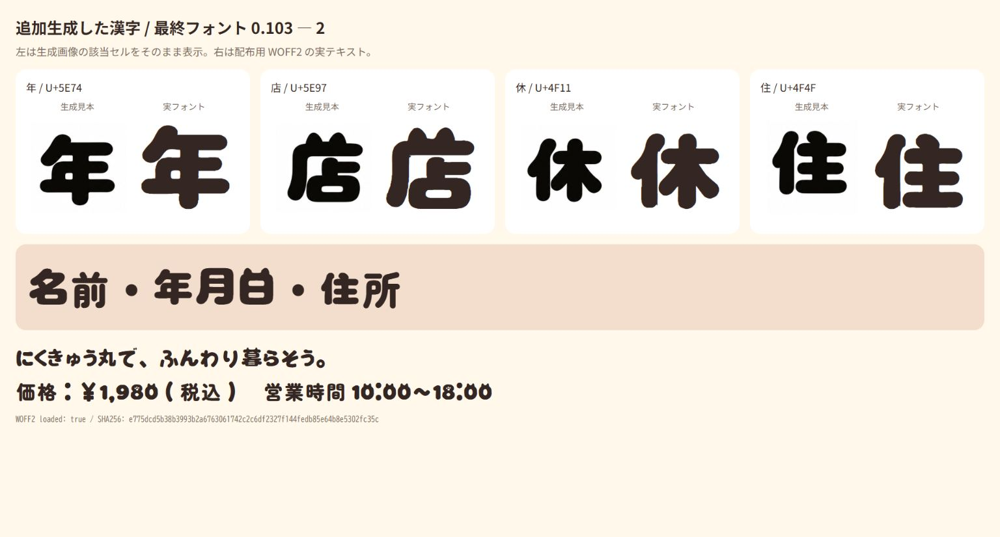

# にくきゅう丸 0.103 最終表示レビュー

7,516 Unicode文字・7,547グリフの配布用TTF/WOFF2を確認した記録です。

## コンセプト

太く柔らかい輪郭に、一部の猫耳と肉球を添える方針です。元の生成画像から38文字とss01異体字2個を抽出し、「ゃ・ゅ」の2文字は大きさを揃えるため通常かなから派生させています。追加生成から「名・今・日・月・年・店・休・住」8文字を採用し、最終的に直接使う画像由来輪郭は44文字とss01異体字2個です。一般漢字にはZen Maru Gothic Blackを基準とした丸みを使い、読み取りに必要な線を残しています。漢字中心の文章では猫の装飾は控えめです。

生成画像の左セルとフォントの右セルは、大きさが異なります。輪郭・猫耳・白い内部空間を比較する画像であり、ピクセル完全一致を主張するものではありません。8字は16・24・32・48pxの実TTF描画でも確認しました。「日・月」はかな平均より黒みが強いものの、二つの内部空間を識別できます。

元の見本との比較は[大見出し](comparison/final-0103-1.png)、[かな](comparison/final-0103-2.png)、[英数字](comparison/final-0103-3.png)です。

## 全グリフと実用文章

Chromeで配布WOFF2を読み込み、`.notdef`を除く7,546個の字形を158枚に分けて撮影。rootとLuna Maxの3担当が、全画像を個別に開いて目視しました。空白3種を除く未描画、セル外切れ、具体的な欠けは確認されませんでした。密な漢字の細部について、すべての小サイズ・表示環境での可読性を保証する監査ではありません。

- [001–040](audit/review-01-40.md) / [041–080](audit/review-41-80.md) / [081–120](audit/review-81-120.md) / [121–158](audit/review-121-158.md)
- [各スクショのSHA256と対象フォント](visual-verification.json)
- [名前](practical-review/names.png) / [住所](practical-review/addresses.png) / [価格](practical-review/prices.png) / [年月日](practical-review/dates.png)
- [日常文章](practical-review/daily.png) / [記号](practical-review/symbols.png) / [半角カナ](practical-review/halfwidth-kana.png) / [分解濁点とNFC](practical-review/decomposed-dakuten.png)

用途別の31ケースは全て欠字ゼロ。見本比較を含むコーパスの固有文字は276文字です。半角濁音は2セル幅を保つため、通常の半角カナより文字間が広く見えます。NFDとNFCは同じ合成済み字形で表示されました。

## 構造・環境の確認

[機械検査](verification.json)では全非空白文字の64px描画、全グリフの字幅・上下範囲、TTF/WOFF2のcmap一致が通過。[HarfBuzz](kana-shaping-verification.json)ではcanonical58組・半角28組・通常半角63字が通過。[Windows](windows-font-verification.json)ではprivate fontとして一時読込し、日本語のファミリー名と35文字のグリフ取得を確認後、解除しました。

元のZenとの輪郭数比較では19字が目視候補となりました。[元TTFと出力TTFの比較](japanese-outline-review.png)を確認し、明らかな線の消失は見つかりませんでした。輪郭の方向から推定した数には微小な接触や分割の差も含まれるため、字形の正しさを輪郭数だけで判定していません。

横組みの太い見出し向けです。縦組み専用メトリクス、ヒンティング、カーニングは実装していません。
