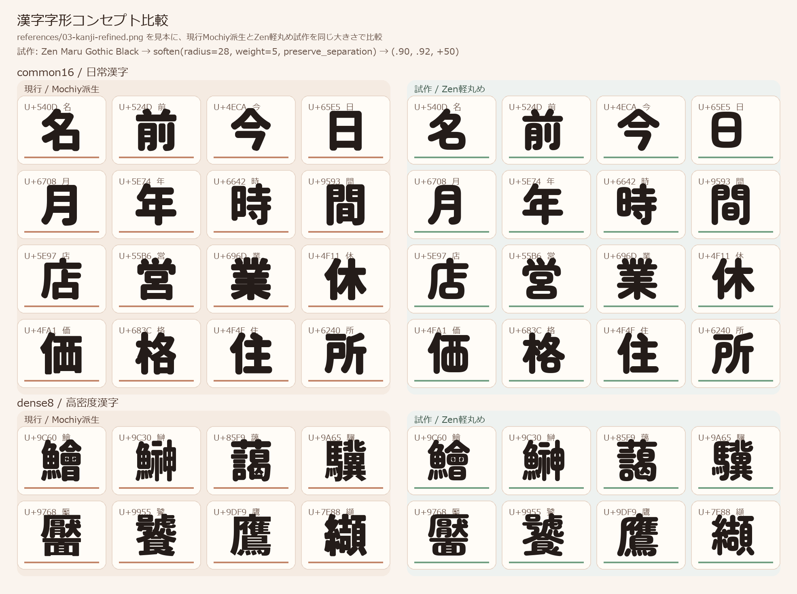

# 漢字字形コンセプト比較

0.103では、一般漢字の基準輪郭にZen Maru Gothic Blackを採用した。Zenの輪郭を半径28、太らせ量5、離れた部品を保持する設定で丸め、既存のCJK用変換を適用する。かな・英字・記号と既存のデザイン資産、不足する漢字の補完にはMochiy Pop Oneを使う。

## 比較対象

- common16: 名前今日月年時間店営業休価格住所
- dense8: 鱠鰰藹驥靨饕鷹纈
- 参照画像: [03-kanji-refined.png](../../references/03-kanji-refined.png)
- 現行フォント: [NikukyuMaru-Regular.ttf](../NikukyuMaru-Regular.ttf)
- 比較データ: [kanji-base-comparison.json](kanji-base-comparison.json)

common16のうち、名・今・日・月・年・店・休・住の8字は生成見本03からベクター輪郭を起こし、[kanji-concept-outlines.json](../../sources/kanji-concept-outlines.json)として採用した。前・時・間・営・業・価・格・所は画像の比較対象に含むが、0.103では読みやすさを優先してZen由来の字形を採用し、追加画像輪郭にはしていない。

## 評価と採用理由

Zenを一般漢字の基準にすることで、追加漢字を含む日常文字の角と太さを同じ丸め処理へ通せる。dense8では、離れた部品を保持する設定が線の融合を抑え、鱠・鰰・藹などの内部を確認しやすくする。ただし複雑漢字は小サイズで密に見えるため、全アプリ・全サイズの可読性を保証する判断ではない。

生成見本由来の8字は、実TTFの構造・範囲と、かなを並べた180pxおよび16・24・32・48pxの実描画を確認して採用した。[kanji8-final-verification.json](kanji8-final-verification.json)はpassed=true、errors=[]を記録している。日・月はかなの中央値より黒みが強いが、内部空間は確認できる。住の輪郭分解数差は形状の消失ではなくコンパイル時の分解差である。

この比較はcommon16とdense8の計24字を使った基準選定の証跡であり、全JIS漢字6,355字の個別目視完了を表すものではない。現行フォントの全収録範囲はcmap 7,516 Unicode文字、glyphOrder 7,547グリフである。

## 元参照輪郭の数え方

sources/reference-outlines.jsonは40キーで、Unicode文字38キーとss01用のこ.alt・る.alt 2キーを保持する。うち小書きゃ・ゅの2字は、読みやすいサイズ調整のためharmonizeで通常かなから派生する。したがって最終的に直接適用される元参照はUnicode36字形 + .alt 2字形で、採用した追加8字を合わせた直接適用の画像由来輪郭はUnicode44字形 + .alt 2字形である。抽出データ40キー自体は変更せず保持する。

## 証跡

- [採用8字の180px・小サイズ画像](kanji8-final-render.png) / [小サイズ一覧](kanji8-final-sizes.png)
- [採用8字の機械検証](kanji8-final-verification.json)
- [最終比較1](final-page-1.png) / [最終比較2](final-page-2.png)
- [全体の最終表示レビュー](../FINAL-REVIEW.md)

用途は太い横組み見出しで、縦組み専用の回転・メトリクス、カーニング、ヒンティングは実装していない。
